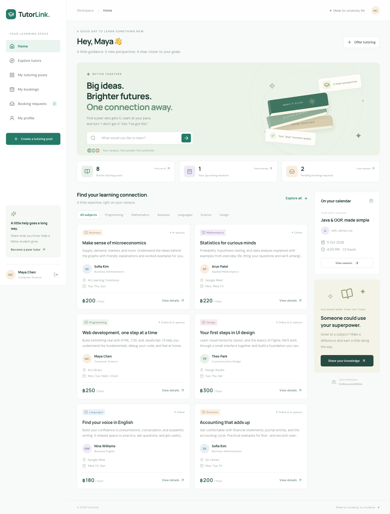
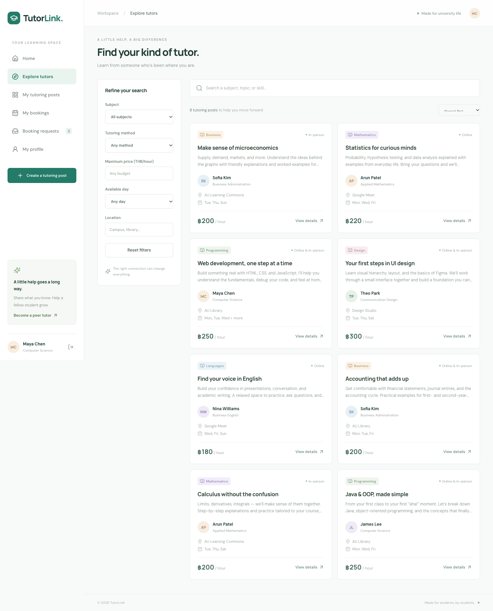
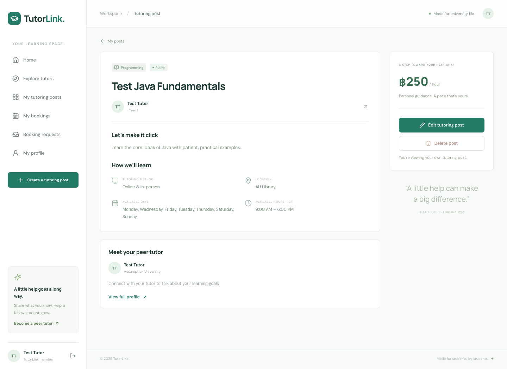
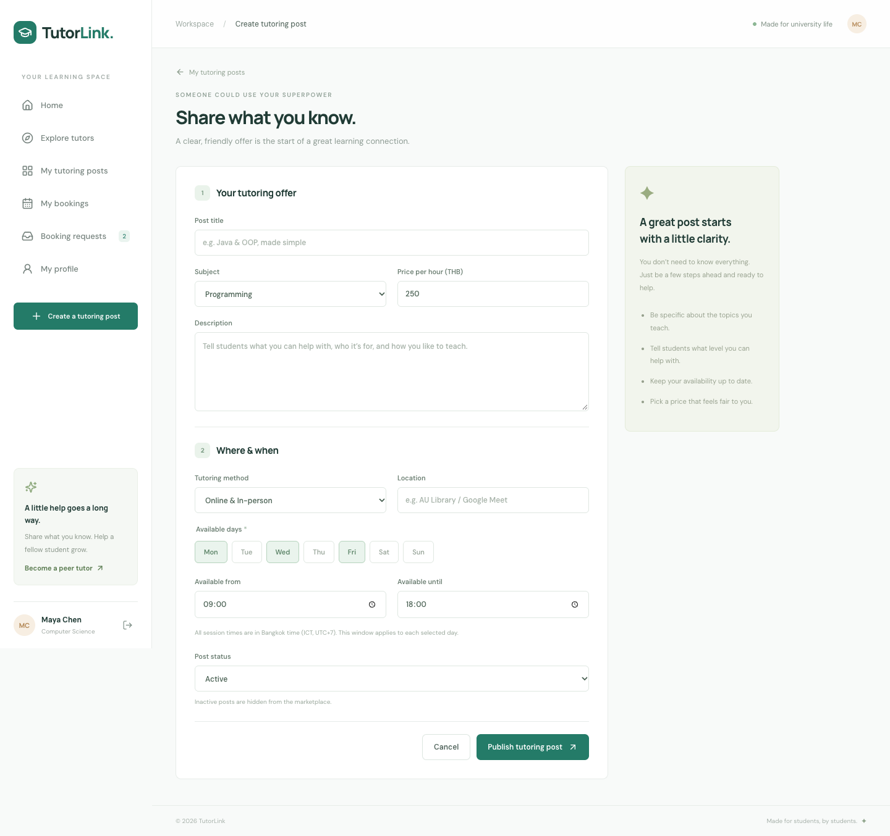
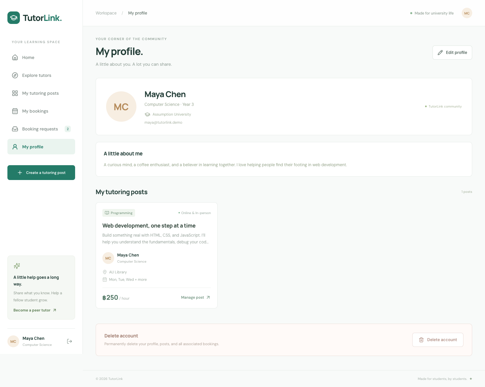
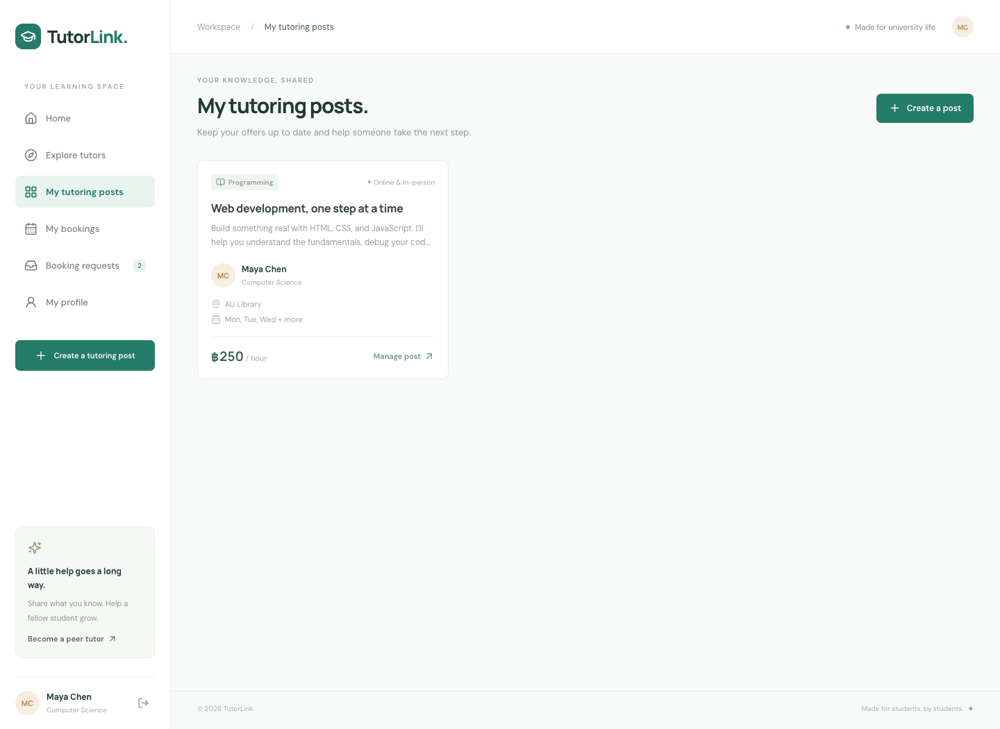
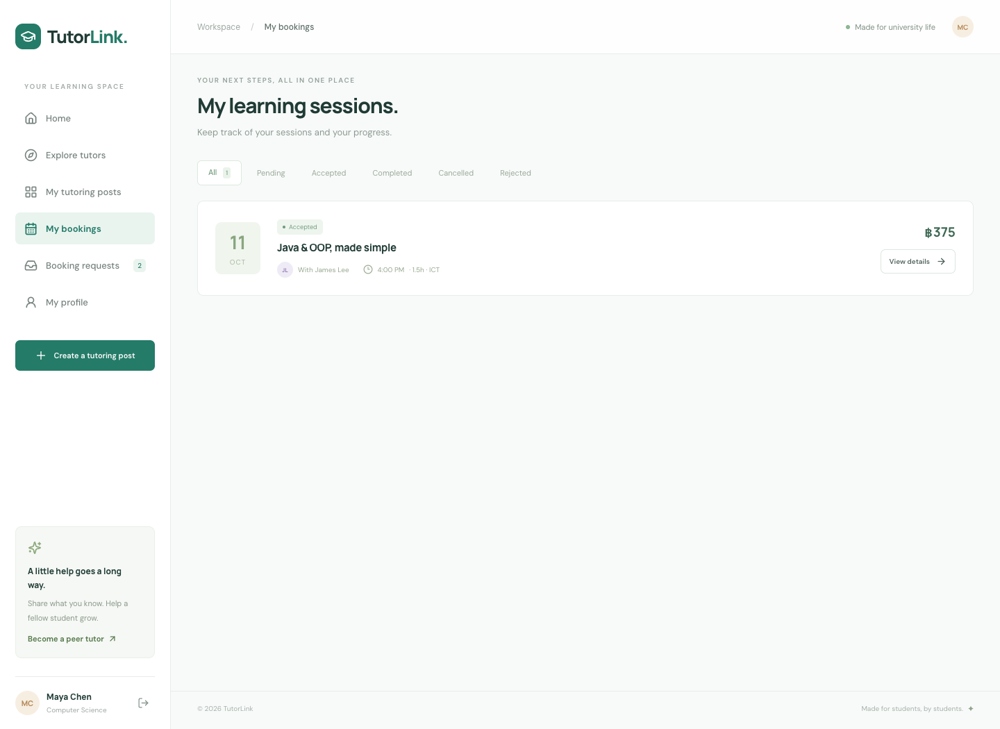
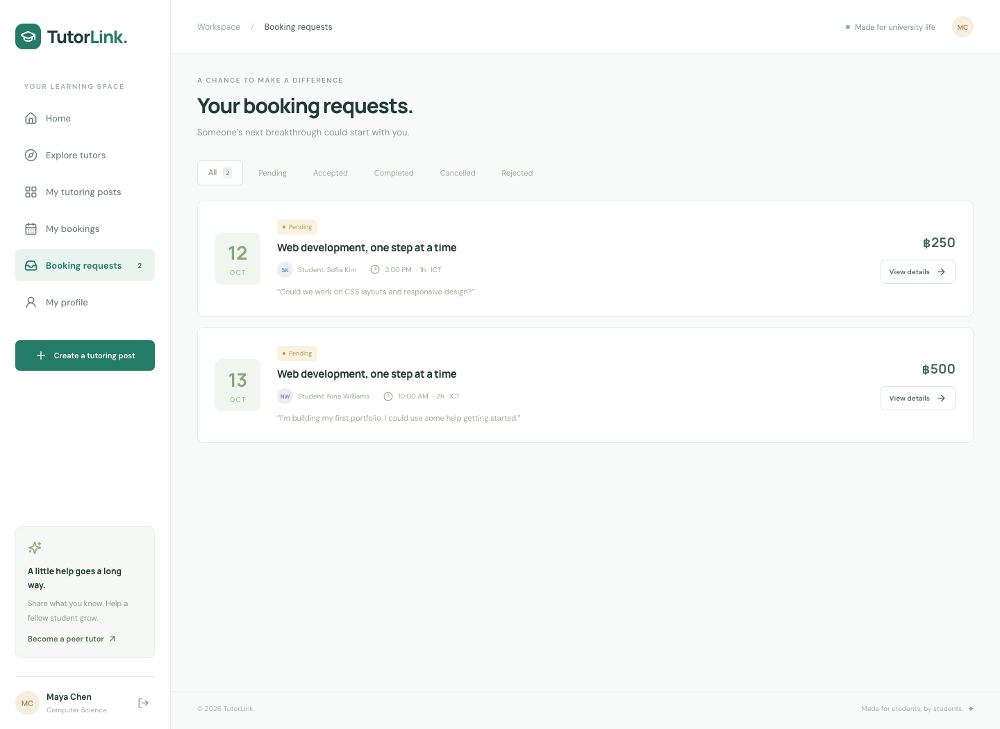
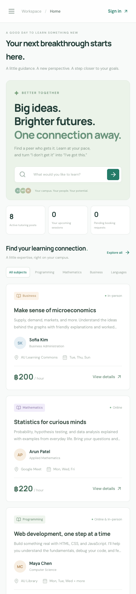

# TutorLink

A peer tutoring social marketplace for university students. Every member can both learn and teach using the same account. Originally built with Next.js, MongoDB, and REST APIs according to `instruction.md`.

## Team members

- KAUNG ZAW HEIN — [GitHub](https://github.com/NYOWI1)
- MOE MYINT CHO — [GitHub](https://github.com/MoeMyintCho)
- SHAUN LAI KYAW SAN — [GitHub](https://github.com/SHAUN14487)

Repository: [NYOWI1/TutorLink](https://github.com/NYOWI1/TutorLink).

## Features

- Email/password registration and sign-in, password hashing, HTTP-only session cookies.
- Public profiles, private account details, profile editing, and account deletion.
- Tutoring post creation, feed, details, editing, activation/deactivation, and deletion.
- Search by topic; filter by subject, maximum price, method, day, and location.
- Booking creation, details, pending-booking editing, cancellation, and resolved-booking deletion.
- Tutor acceptance, rejection, and completion of sessions after their scheduled end.
- Responsive desktop, tablet, and mobile UI, with loading, empty, and error states.
- Server-side ownership and booking validation. Transactional overlap checks reserve both participants’ time while a booking is pending or accepted.
- Self-hosted VM deployment files with MongoDB, Docker Compose, and Nginx.

Payment processing, ratings, reviews, real-time chat, and video calls are outside the specified POC scope.

## Technology stack

Next.js App Router, React, TypeScript, Mongoose/MongoDB, Zod, bcrypt, signed JWT sessions, and Lucide icons. Playwright tests run through Chrome. CSS creates the book illustration without external image assets.

## Project structure

```text
TutorLink/
├── src/
│   ├── app/           # Next.js pages, layouts, and REST API routes
│   ├── components/    # Shared interface and feature screens
│   ├── lib/           # Authentication, database connection, API logic, validation, types
│   └── models/        # User, TutorPost, and Booking schemas
├── public/            # Static assets and README screenshots
├── scripts/           # Local development, optional seeding, screenshots, production checks
├── tests/             # Unit and browser/API tests
├── deploy/            # Nginx snippets and environment examples
├── docs/              # Proposal, deployment, and optional Atlas instructions
├── compose.yaml       # VM containers; supports MONGODB_URI override
├── Dockerfile
├── .env.example       # Template only; actual environment files stay untracked
└── package.json
```

Pages use individual route files (`src/app/posts/[id]/page.tsx`, for example), so unknown URLs receive a proper 404 response. Configuration and environment files remain at the project root.

Generated local folders (`.data`, `.next`, and test reports) are excluded from Git and may be removed when local development is stopped. The local demo database is recreated when `npm run dev` runs without an external URI. `node_modules` contains required dependencies and is retained.

## Get started

Requires **Node.js 24** and npm. The first local run needs internet access to download a MongoDB binary and install packages.

```sh
npm ci
npm run dev
```

Open [http://localhost:3000](http://localhost:3000), or the port printed by Next.js if 3000 is occupied. For tests on another port, set `TEST_ORIGIN=http://localhost:3001`.

`npm run dev` starts an actual local MongoDB single-node replica set on port 27018, seeds sample data when the users collection is empty, then starts Next.js. Database files persist in the ignored `.data/mongo` directory. Stop with Ctrl+C. A development-only JWT secret is generated at startup; restarting signs users out but preserves their data.

### Demo sign-in

- Email: `maya@tutorlink.demo`
- Password: `TutorLink2026!`

The other seeded accounts (`james`, `sofia`, `arun`, `nina`, `theo` at `tutorlink.demo`) use the same password. Maya has a tutoring post, an accepted student booking, and incoming requests. These are sample accounts for local development. Production does not seed them automatically.

### Use your own MongoDB

The live app was subsequently configured to use the requested Atlas cluster. Local development keeps its separate demo database unless `.env.local` specifies a different connection. See [Atlas setup](docs/ATLAS.md) for that optional configuration.

Use a **replica set**, because booking creation and cascading deletion use transactions. Set `MONGODB_URI` and `JWT_SECRET` in `.env.local`, then run `npm run dev:external` to start Next.js without the bundled MongoDB launcher. `npm run seed` accepts an exported `MONGODB_URI` if you want demo data in an external development database; it only seeds an empty database.

## Environment variables

See `.env.example`. Keep actual secrets in ignored environment files.

| Variable      | Purpose                                                                               |
| ------------- | ------------------------------------------------------------------------------------- |
| `MONGODB_URI` | Connection string for MongoDB (self-hosted replica set or the optional Atlas cluster) |
| `JWT_SECRET`  | Random secret of at least 32 characters; generate with `openssl rand -hex 48`         |
| `APP_ORIGIN`  | Exact browser origin, including scheme and port; use the HTTPS domain in production   |

`npm run build` compiles the production app. `npm start` runs the build with the environment from `.env.local` or exported variables. Production session cookies require HTTPS; use the provided Nginx deployment.

## Data models

| Model     | Relationship and CRUD                                                                           |
| --------- | ----------------------------------------------------------------------------------------------- |
| User      | Registration, public/own profile, profile update, password-confirmed account deletion           |
| TutorPost | References its User owner; create/read/update/delete through the API and UI                     |
| Booking   | References TutorPost, student User, and tutor User; create/read/reschedule/status update/delete |

Deleting an account transactionally removes its posts and bookings. A post with pending or accepted bookings cannot be deleted until those bookings are resolved. Deleting a post also deletes its resolved booking history. Only the student can delete a cancelled, rejected, or completed booking; both participants see its removal.

## REST API

All endpoints return JSON. Mutations use `Content-Type: application/json`. Ownership is verified on the server; never pass a user ID as proof of identity.

| Resource | Collection endpoint                       | Item endpoint                            |
| -------- | ----------------------------------------- | ---------------------------------------- |
| Users    | `GET /api/users`, `POST /api/users`       | `GET`, `PUT`, `DELETE /api/users/:id`    |
| Posts    | `GET /api/posts`, `POST /api/posts`       | `GET`, `PUT`, `DELETE /api/posts/:id`    |
| Bookings | `GET /api/bookings`, `POST /api/bookings` | `GET`, `PUT`, `DELETE /api/bookings/:id` |

Authentication: `POST /api/auth/login`, `POST /api/auth/logout`, `GET /api/auth/me`.

- Public endpoints: registration, user profiles/list, active posts/list.
- `GET /api/posts?mine=true` returns the signed-in user’s active and inactive posts.
- Search/filter query parameters: `q`, `subject`, `method`, `price` (maximum), `location`, `day`, `userId`, `sort=price`.
- `GET /api/bookings` returns the signed-in student’s sessions; `?role=tutor` returns incoming requests.
- Booking creation body: `{ "tutorPostId": "...", "sessionDate": "2030-01-07", "startTime": "10:00", "duration": 1, "message": "..." }`.
- Booking status body: `{ "status": "Accepted" }` (tutor only), or the allowed transition below.
- Profile deletion body: `{ "password": "your-current-password" }`.
- Passwords, password hashes, and private emails are never included in public profiles or populated booking/post data.

HTTP codes: 200 read/update/delete, 201 create, 400 validation, 401 sign-in required, 403 unauthorized, 404 missing, 409 conflict, 503 service unavailable.

### Booking rules

All dates and times use **Asia/Bangkok (ICT, UTC+7)**. Sessions must be in the future, fit a selected available day and time window, and have a duration of 0.5–8 hours in half-hour increments. Users cannot book themselves, inactive posts, or overlapping pending/accepted sessions involving either participant. Hourly prices are captured at booking time, so later post edits do not change a booking’s agreed price.

| Actor   | Allowed transitions                                                     |
| ------- | ----------------------------------------------------------------------- |
| Tutor   | Pending → Accepted / Rejected; Accepted → Completed after scheduled end |
| Student | Pending / Accepted → Cancelled                                          |
| Student | Edit date, time, duration, and message while Pending                    |

## Pages

`/`, `/explore`, `/login`, `/register`, `/posts/new`, `/posts/mine`, `/posts/:id`, `/posts/:id/edit`, `/bookings`, `/bookings/:id`, `/requests`, `/profile`, `/profile/edit`, `/profile/:id`.

## Tests

```sh
npm run typecheck
npm test
# With npm run dev running in another terminal:
npm run test:e2e
```

Six unit tests and three browser/API tests pass. They cover registration, user/post/booking CRUD, ownership checks, self-booking rejection, concurrent overlapping reservations, rejection and completion, status changes, search, and mobile overflow/navigation. The deployed HTTPS app also passed registration, login, profile editing, post creation, booking, acceptance, cancellation, deletion, origin validation, and mobile checks; temporary smoke-test data was removed.
Production verification: `SMOKE_ORIGIN=https://nyxen.centralindia.cloudapp.azure.com/tutorlink npm run test:production`. This creates temporary test accounts and deletes them after verification.

Regenerate screenshots with `npm run screenshots` while local development is running; set `SCREENSHOT_ORIGIN` if it uses another port.

`CHROME_PATH` can override the Chrome executable path in `playwright.config.ts` for Linux or other installations.

## Screenshots

Screenshots are captured from the working application with Playwright.











## Deployment

Follow [the VM deployment guide](docs/DEPLOYMENT.md). `Dockerfile`, `compose.yaml`, and `deploy/nginx.conf` run the app and MongoDB on your own VM. No Vercel, serverless hosting, or managed backend is required.

The MongoDB Docker network is internal and its port is not published. The app exposes only a loopback port to host Nginx. Enable HTTPS before testing production authentication.

## Production URL and submission

Production target: [TutorLink on the VM](https://nyxen.centralindia.cloudapp.azure.com/tutorlink). Deployed and verified over HTTPS on 5 October 2026 (Bangkok time). The app and MongoDB run in separate containers on the supplied VM, with TutorLink served through the existing Nginx certificate at `/tutorlink`.

A scope-matching [proposal draft](docs/PROPOSAL.md) is included. The team must submit the proposal on time, maintain its own Git history, and record the required approximately five-minute demonstration.
